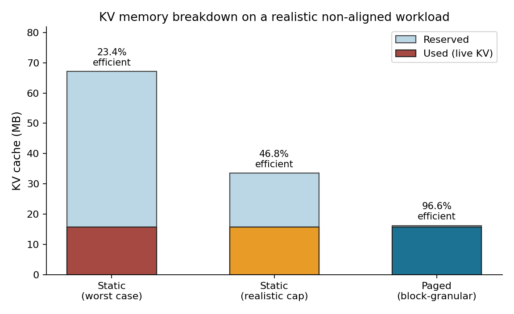
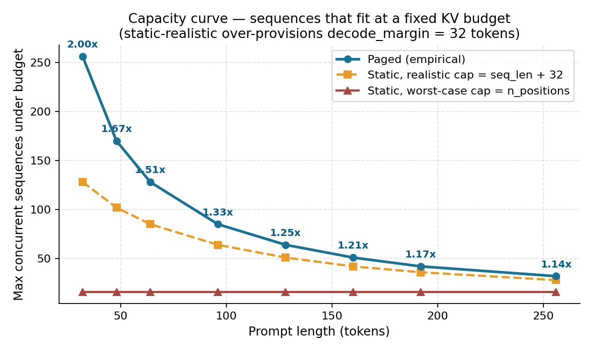
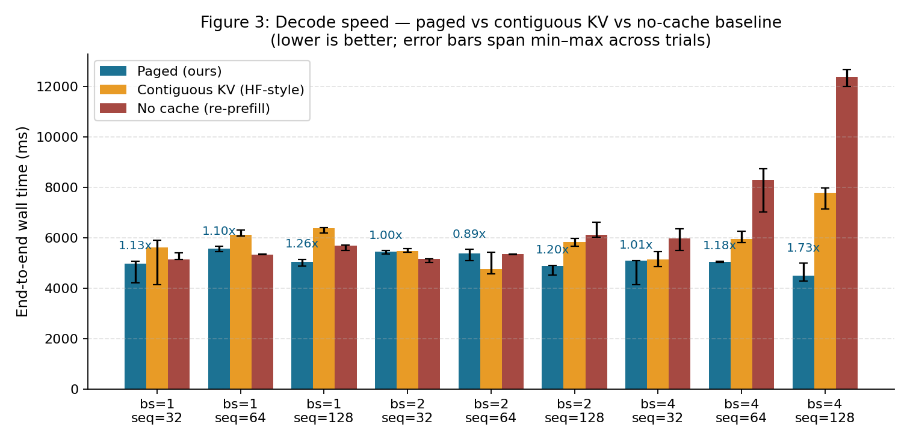
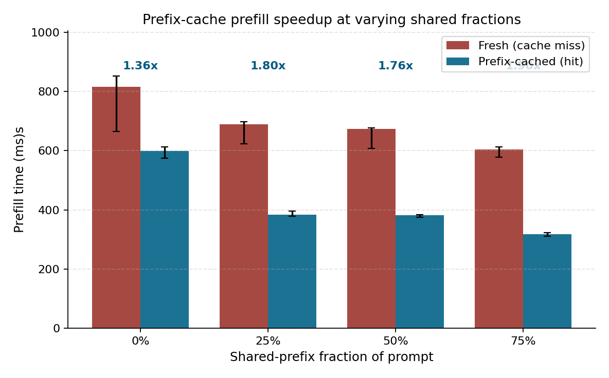
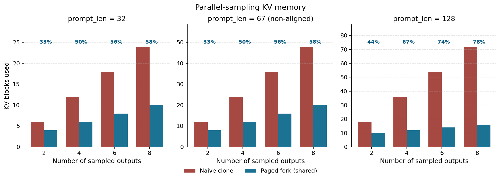
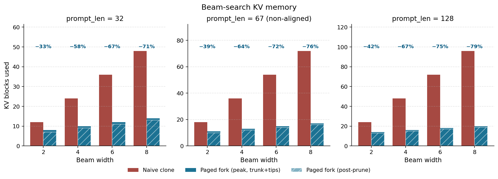

# PagedAttention in MiniTorch Documentation

This documentation is written for a reader who is new to PagedAttention and only lightly familiar with transformers. It explains the project in layers: first the MiniTorch and transformer ideas you need, then the block allocator, attention paths, CUDA runtime, model integration, advanced sharing mechanisms, and finally how to run and interpret the project.

A single-file Simplified Chinese version is available at [README.zh-CN.md](README.zh-CN.md).

The repository already contains historical project material in `docs/design.md`, `docs/REVIEW.md`, `docs/reports/`, and `benchmarks/README.md`. The files linked below are the maintained learning path for understanding the runnable implementation.

## Reading Order

1. Start with the foundations:
   - [foundations/minitorch-primer.md](foundations/minitorch-primer.md)
   - [foundations/transformer-and-kv-cache.md](foundations/transformer-and-kv-cache.md)
   - [reference/glossary.md](reference/glossary.md)
2. Read the core implementation walkthroughs:
   - [core/block-manager.md](core/block-manager.md)
   - [core/paged-attention-python.md](core/paged-attention-python.md)
   - [core/cuda-kernel-and-runtime.md](core/cuda-kernel-and-runtime.md)
   - [core/transformer-integration.md](core/transformer-integration.md)
3. Then read the advanced serving behavior:
   - [advanced/prefix-cache-and-sharing.md](advanced/prefix-cache-and-sharing.md)
   - [advanced/memory-and-capacity.md](advanced/memory-and-capacity.md)
4. Use the project:
   - [usage/setup-and-build.md](usage/setup-and-build.md)
   - [usage/running-inference.md](usage/running-inference.md)
   - [usage/testing-and-benchmarking.md](usage/testing-and-benchmarking.md)
5. Use the reference material when you need a map:
   - [reference/code-inventory.md](reference/code-inventory.md)
   - [reference/api-reference.md](reference/api-reference.md)

## Where To Start

| Goal | Start here | Why |
| --- | --- | --- |
| I do not know PagedAttention | [foundations/transformer-and-kv-cache.md](foundations/transformer-and-kv-cache.md) | Explains prefill, decode, KV cache, and the memory problem before code. |
| I know attention but not this repo | [core/block-manager.md](core/block-manager.md) | The allocator is the central abstraction that makes the rest of the implementation make sense. |
| I want to run the project | [usage/setup-and-build.md](usage/setup-and-build.md) | Covers dependencies, CUDA compilation, and environment assumptions. |
| I want to change code safely | [reference/code-inventory.md](reference/code-inventory.md) | Tells you which files are core, inherited, generated, tests, or reporting tools. |
| I want to understand the CUDA path | [core/cuda-kernel-and-runtime.md](core/cuda-kernel-and-runtime.md) | Connects the Python wrapper to `src/paged_attention.cu`. |
| I want to explain benchmark figures | [advanced/memory-and-capacity.md](advanced/memory-and-capacity.md) and [usage/testing-and-benchmarking.md](usage/testing-and-benchmarking.md) | Separates allocator effects from timing and plotting details. |
| I want the result-graph interpretation | [Result Graph Interpretations](#result-graph-interpretations) | Summarizes what each generated figure proves and what it does not prove. |

## Mental Model

PagedAttention in this project has three layers:

1. A decoder-only transformer computes query, key, and value vectors.
2. A `BlockManager` stores key/value vectors in fixed-size physical blocks and gives each sequence a block table that maps logical token positions to physical blocks.
3. During decode, attention reads the sequence's historical keys and values through that block table instead of assuming the cache is contiguous.

The key idea is simple: a sequence is logically contiguous even when its KV cache is physically scattered. The block table is the translation layer.

## Result Graph Interpretations

The report figures are produced by `project/run_rigorous_benchmark.py` and `project/plot_rigorous_figures.py`, then written to [../benchmarks/report_figures_v2](../benchmarks/report_figures_v2). They are best read as allocator and mechanism evidence, not as a reproduction of vLLM's full production serving throughput.

### Figure 1: KV Memory Breakdown

This is the central allocator result. The realistic non-aligned workload exposes both static over-reservation and tail-block fragmentation. Worst-case static reservation is only `23.4%` efficient, a realistic static cap reaches `46.8%`, and paged block-granular allocation reaches `96.6%`. The main point is that PagedAttention saves memory because KV cache is allocated for real tokens in blocks, not pre-reserved as a maximum-length slab for every request.

### Figure 2: Capacity Curve Under A Fixed KV Budget

This figure fixes the KV memory budget and asks how many concurrent sequences fit. Paged allocation gives the largest gain for short prompts, where static `seq_len + 32` reservation over-provisions heavily; the measured gain reaches `2.00x`. As prompt length grows, the static margin is a smaller fraction of the total, so the gain narrows, but paged allocation still gives `1.14x` at `256` tokens. This matches the PagedAttention paper's core memory-management claim: better KV allocation increases admission headroom.

### Figure 3: Decode Speed

Read this one carefully. Paged decode is generally faster than the no-cache re-prefill baseline because it reuses historical K/V instead of recomputing the whole context every step. Compared with the contiguous-KV baseline, the result is closer and sometimes favors contiguous KV. That is expected: this project uses a teaching-oriented MiniTorch runtime and a simple CUDA kernel, not vLLM's production kernels, layouts, online softmax, long-context partitioning, or serving scheduler. Figure 3 shows that caching works; it should not be framed as production throughput parity.

### Figure 4: Prefix-Cache Prefill Speedup

This graph shows the benefit of reusing full cached prefix blocks and computing only the suffix. For shared-prefix fractions of `0%`, `25%`, `50%`, and `75%`, the measured speedups are about `1.36x`, `1.80x`, `1.76x`, and `1.90x`. The important trend is that more reusable full blocks reduce prefill work. The `0%` speedup should not be overinterpreted because short timing runs can be affected by metadata and runtime noise.

### Figure 5: Parallel-Sampling KV Memory

Parallel sampling generates multiple outputs from the same prompt. A naive clone baseline stores a private prompt KV copy for each output, while paged fork shares the prompt blocks and allocates only divergent suffix blocks. The savings range from about `33%` to `78%`; longer prompts and more sampled outputs make sharing more valuable. This is the block-table/reference-count mechanism turning multi-output reuse into metadata sharing instead of tensor copying.

### Figure 6: Beam-Search KV Memory

Beam-style workloads have the same sharing opportunity: beams share the prompt and may share a generated trunk before they diverge. The naive clone baseline repeats KV for each beam, while paged fork shares prompt/trunk blocks and stores only branch tips. Peak savings are about `33%` to `79%`, and post-prune live blocks can be lower still. This is an allocator simulation rather than a complete quality-aware beam-search scheduler, but it demonstrates the memory effect clearly.

## vLLM/PagedAttention vs This Project

This project implements the same core abstraction as the PagedAttention paper: fixed-size physical KV blocks, per-sequence block tables, logical-to-physical translation, and reference-counted sharing. The engineering target is very different, though. vLLM is a production serving system; this project is a readable MiniTorch implementation that validates the mechanism.

| Dimension | vLLM / PagedAttention production serving | This MiniTorch project |
| --- | --- | --- |
| Goal | Serve real LLM requests with high throughput and controlled latency. | Rebuild the mechanism in a teaching framework with inspectable code and focused benchmarks. |
| Model and inputs | Real pretrained LLMs, tokenizers, and online serving workloads. | Synthetic MiniTorch runs plus a full-model MiniTorch GPT-2 benchmark using pretrained weights and real WikiText tokens. |
| Scheduler | Continuous batching, admission control, request lifecycle management, and memory pressure handling. | Mostly static benchmark loops; no full online scheduler, queueing model, or preemption. |
| KV source of truth | GPU-resident KV cache is the serving-critical state integrated with scheduler and kernels. | The default teaching path still supports CPU NumPy K/V, while the GPT-2 benchmark uses a host-cache-free `BlockManager` and GPU-resident contiguous/paged K/V. |
| Memory layout | GPU-optimized layouts for coalesced/vectorized access, precision choices, and large contexts. | Clear `(num_blocks, block_size, n_head, head_dim)` layout for teaching and correctness. |
| Attention kernels | Production-optimized paged attention kernels with batching, long-context strategies, and hardware-aware implementation. | A readable V1-style CUDA decode kernel without vLLM-level template specialization, online softmax, or V2 long-context decomposition. |
| Host/device transfers | End-to-end execution avoids unnecessary host synchronization. | The GPT-2 benchmark avoids CPU/GPU K/V transfers; some older reference/wrapper paths still copy query/output or metadata for clarity. |
| Prefix and branch sharing | Integrated with real serving policies for prefix reuse, parallel sampling, and beam-like workloads. | Full-block prefix cache plus `fork_sequence`/`clone_sequence` simulations; no complete quality-aware beam scheduler. |
| Precision and scale | FP16/BF16-style inference at large model scale. | Mostly `float32`, smaller model sizes, correctness-first measurements. |
| Baselines and metrics | End-to-end serving throughput, latency, and capacity against production baselines. | Allocator efficiency, fixed-budget capacity, prefix reuse, branch memory, and microbenchmark latency. |

So the precise claim is: this project reproduces the core memory-management mechanism of PagedAttention and validates its allocator/sharing benefits. It does not reproduce vLLM's production serving environment, where scheduler design, optimized GPU kernels, real model execution, and workload-level batching are all part of the final speedup.

## Existing Project Documents

- [design.md](design.md) is the original architecture/design snapshot.
- [REVIEW.md](REVIEW.md) is an audit trail with project status, gaps, and benchmark notes.
- [../benchmarks/README.md](../benchmarks/README.md) summarizes benchmark outputs and plots.
- [reports/](reports/) contains proposal, midterm, and poster artifacts. Treat these as historical/presentation material, not the primary implementation guide.

## Conventions Used In These Docs

- `seq_id` means the application-level identifier for an active sequence.
- `block_id` means a physical KV cache block owned by the `BlockManager`.
- `logical_block` means the block number within one sequence, computed from a token index.
- Tensor shapes are written in row-major logical order, for example `(batch, n_head, seq_len, head_dim)`.
- The Python reference implementation is described as correctness-first; the CUDA implementation is described as an optimized path with the same contract.
